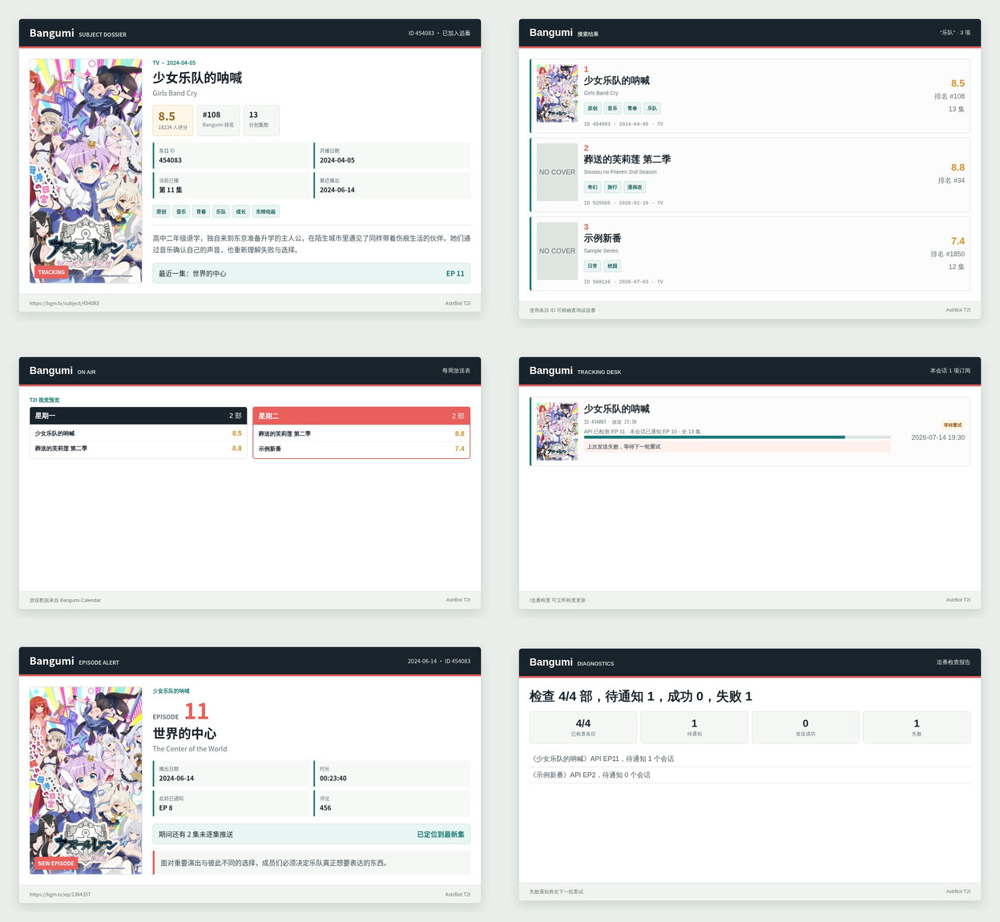

# AstrBot Bangumi 追番助手

[](https://github.com/united-pooh/astrbot_plugin_bangumi)
[](LICENSE-2.0)

面向群聊和多平台会话的 Bangumi 条目查询、放送日历与更新通知插件。2.0 版本重写了 API、数据库、调度、订阅和卡片层，所有卡片统一使用 AstrBot 的 `html_render` 接口调用 [astrbot-t2i-service](https://github.com/AstrBotDevs/astrbot-t2i-service) 渲染。

## 核心特性

- 名称或 Bangumi 条目 ID 查询，数字 ID 直接访问条目详情。
- TV 动画、剧场版、漫画分类搜索。
- 每周放送表和今日放送卡片。
- 每个会话独立记录通知进度，失败通知自动重试。
- 订阅成功立即返回信息完整的条目卡片。
- 手动检查、测试卡片、错误状态和放送时间修正。
- 旧版 `data.db` 原地迁移，不要求清空订阅。
- 单一 AstrBot T2I 渲染链路，渲染失败自动降级为纯文字。

## 卡片预览

以下总览由 `scripts/preview_t2i_cards.py` 通过 AstrBot 官方 T2I 服务实际生成，包含条目详情、搜索、日历、追番状态、更新通知和检查报告。



## 命令

| 命令 | 参数 | 说明 |
| --- | --- | --- |
| `/bgm` | `<名称\|ID> [数量]` | 搜索全部条目；空参数或 `help` 显示帮助 |
| `/bgm help` | 无 | 显示图形化命令帮助 |
| `/bgm番剧` | `<名称\|ID> [数量]` | 搜索 TV 动画 |
| `/bgm动漫` | `<名称\|ID> [数量]` | `/bgm番剧` 别名 |
| `/bgm动画` | `<名称\|ID> [数量]` | `/bgm番剧` 别名 |
| `/bgm番` | `<名称\|ID> [数量]` | `/bgm番剧` 别名 |
| `/bgm动画片` | `<名称\|ID> [数量]` | `/bgm番剧` 别名 |
| `/bgm剧场版` | `<名称\|ID> [数量]` | 搜索动画剧场版 |
| `/bgm电影` | `<名称\|ID> [数量]` | `/bgm剧场版` 别名 |
| `/bgm漫画` | `<名称\|ID> [数量]` | 搜索漫画 |
| `/calendar` | 无 | 查看每周放送表 |
| `/放送表` | 无 | `/calendar` 别名 |
| `/today` | 无 | 查看今日放送 |
| `/今日番剧` | 无 | `/today` 别名 |
| `/追番` | `<名称\|ID>` | 订阅动画；名称有歧义时回复候选序号选择 |
| `/追番列表` | 无 | 查看检测进度、通知进度、放送时间和错误 |
| `/追番状态` | 无 | `/追番列表` 别名 |
| `/追番检查` | 无 | 立即检查本会话并重试失败通知 |
| `/追番测试` | `<名称\|ID>` | 渲染最新一集测试卡片，不改变通知进度 |
| `/弃坑` | `<名称\|ID>` | 取消本会话订阅 |
| `/放送时间` | `[名称\|ID] [YYYY-MM-DD] [HH:MM]` | 查看或修正 CST 首播日期和每周放送时间；兼容仅输入时间或“清空” |
| `/bgm模板` | 任意 | 兼容旧命令；2.0 已统一使用 T2I 主题 |

名称搜索可能得到多个同名或近似条目。候选卡片会展示序号，发送卡片后 60 秒内直接回复序号即可查看详情或完成追番；也可以使用 `/追番 <ID>` 精确订阅，例如：

```text
/追番 454083
```

放送安排会显示 CST 首播日期、星期和时间。手动修正支持以下形式：

```text
/放送时间 454083
/放送时间 454083 23:30
/放送时间 454083 2026-07-15
/放送时间 454083 2026-07-15 23:30
/放送时间 454083 清空
```

## AstrBot T2I

插件不再维护独立的渲染服务器地址。请在 AstrBot 管理面板的文本转图片设置中配置 `t2i_strategy=remote` 和 `t2i_endpoint`，运行时由 AstrBot 的 `Star.html_render()` 调用服务：

```text
POST {规范化后以 /text2img 结尾的 endpoint}/generate
```

推荐部署官方项目：<https://github.com/AstrBotDevs/astrbot-t2i-service>。

插件会向 AstrBot 提交完整 HTML 模板、结构化卡片数据和以下渲染选项：

```json
{
  "full_page": true,
  "type": "jpeg",
  "quality": 88
}
```

如果 T2I 服务不可用：

- 主动更新通知会自动发送纯文字，不会推进失败的通知状态。
- 查询命令会回退为结构化纯文字结果。
- `/追番测试 <ID>` 可独立验证卡片渲染链路。

## 配置

| 配置项 | 默认值 | 说明 |
| --- | --- | --- |
| `access_token` | 空 | 可选 Bangumi Bearer Token |
| `user_agent` | `AstrBot-Bangumi-Plugin/v2.1.0 ...` | Bangumi API User-Agent；空值自动回退默认值 |
| `proxy_url` | 空 | 完整代理 URL |
| `search_limit` | `5` | 名称搜索和追番候选上限，范围 1–10 |
| `check_interval_minutes` | `15` | 自动检查间隔，范围 5–180 分钟 |
| `request_timeout_seconds` | `25` | Bangumi API 请求总超时 |
| `max_retries` | `3` | API 最大尝试次数 |
| `card_quality` | `88` | T2I JPEG 质量 |
| `auto_translate_subject_summary` | `false` | 使用默认模型翻译条目简介 |
| `auto_translate_episode_summary` | `false` | 使用默认模型翻译单集简介 |

旧版的 `proxy_http` 和 `port` 仍会作为迁移期回退读取；旧渲染配置会被忽略。

## 追番语义

1. 订阅时获取当前最新已播普通剧集，并把它设为该会话的通知基线。
2. 订阅成功立即返回条目详情卡片，但不会把历史集数伪装成更新通知。
3. 插件启动约 12 秒后首次检查，之后按配置间隔检查。
4. 合法 `airdate` 是主要播出依据；当天缺少可靠放送时间或日期缺失时，使用评论活动作为保守确认信号。
5. 检测到更新后，为所有落后会话生成卡片并主动发送。
6. 只有发送成功的会话才推进 `last_notified_episode`；失败项保留错误并重试。
7. 一次跨过多集时推送最新一集，并在卡片中标明跳过集数。

`/追番列表` 中：

- `API 已检测` 表示插件已确认的最新播出集数。
- `本会话已通知` 表示该会话最后成功收到的集数。
- 前者大于后者时显示“等待重试”。

## 数据与迁移

数据库位于 AstrBot 插件数据目录的 `data.db`。2.0 继续使用：

- `bangumi_subjects`：条目详情、最新集数、首播日期、每周放送时间、检查时间和错误。
- `subscriptions`：会话与条目的关系、逐会话通知进度和投递错误。

插件初始化时自动补充新字段。旧 QQ 裸群号发送前会解析当前唯一的 aiocqhttp 平台实例 ID；更新检查会在统计和发送前合并指向同一物理群的旧会话别名，避免重复推送。该群下次执行插件命令时也会迁移到 AstrBot 标准 `unified_message_origin`。存在多个 aiocqhttp 实例时不会猜测目标，需要先在对应群执行 `/追番列表` 完成精确迁移。

## 日志诊断

每轮检查会输出：

```text
开始追番检查: 条目=4, 范围=全部会话
《示例动画》API EP4，待通知 1 个会话
追番检查完成: 检查 4/4 部，待通知 1，成功 1，失败 0
```

发生错误时，`/追番列表` 会直接显示最近一次条目检查错误或会话投递错误。

## 本地开发

```powershell
python -m pip install -r requirements.txt
python -m pytest
python -m ruff check main.py src tests
```

使用 AstrBot 当前配置的 T2I 服务生成全部卡片预览：

```powershell
python scripts\preview_t2i_cards.py
```

仅验证追番列表卡片：

```powershell
python scripts\preview_t2i_cards.py --only subscriptions
```

## 打包

Windows 下使用本机 7-Zip，并由 Git 按 `.gitignore` 生成文件列表：

```powershell
.\scripts\package_plugin.ps1
```

默认输出：

```text
dist/astrbot_plugin_bangumi_enhance-v2.1.0.zip
```

## 许可

Apache License 2.0，详见 [LICENSE-2.0](LICENSE-2.0)。
